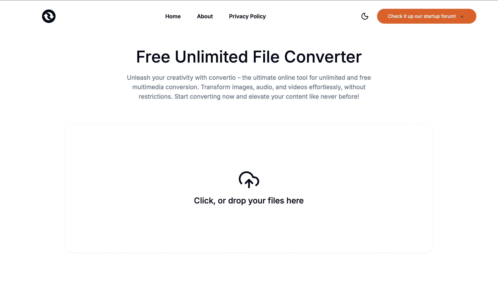

## Free Unlimited File Converter using WebAssembly and FFmpeg

**✅ Next.js 15 App Router**  
**✅ Tailwind CSS**  
**✅ shadcn/ui**  
**✅ WebAssembly**  
**✅ ffmpeg.wasm**

👉 [Live Demo](https://convertioo.vercel.app/) 👈  

  <h3>Home Page</h3>
  

  <h3>Upload & Convert Page</h3>
  

  <h3>Conversion Options</h3>
  

<h3><a style="color:#08b5ff" href="https://github.com/emreyn1">Follow me on Github</a></h3>